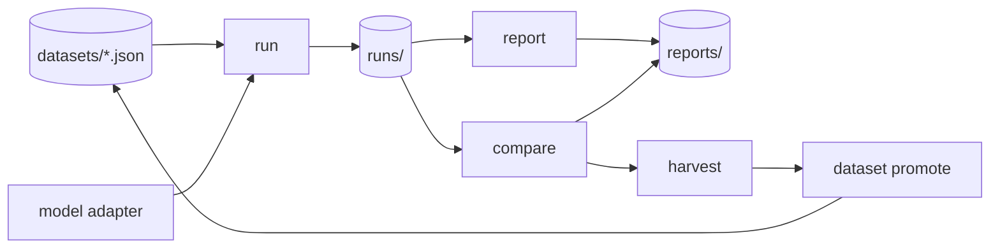

# Model Failure Lab


**Local-first evaluation and failure analysis for LLM and RAG systems.** Run prompt datasets through
a model, classify the failures, compare two model versions, and turn regressions into reusable test
cases — all from the command line, with deterministic artifacts you can commit and diff.

The whole product is one loop:

```
run  ->  report  ->  compare  ->  harvest  ->  promote  ->  rerun
```

No server, no account, no cloud. Everything runs on your machine and writes plain JSON.

## Why

When a model changes, you want to know **what got worse, where, and why** — and you want that answer
to be reproducible. Model Failure Lab keeps a deterministic history of every run and comparison so a
regression becomes a durable dataset and a reviewable decision, not a screenshot in a chat thread.

The supported core (`run` / `report` / `compare` and the dataset/harvest workflow) depends only on
Python 3.11+ and `PyYAML`. Model providers and the heavier research surfaces are **optional extras**
you opt into.

## Install

From a published distribution:

```bash
pip install model-failure-lab
```

From a clone:

```bash
git clone https://github.com/Padraigobrien08/model-failure-lab
cd model-failure-lab
make install            # equivalent to: python3 -m pip install .
```

This installs the `failure-lab` command (also available as `model-failure-lab`, or
`python3 -m model_failure_lab`).

### Optional extras

| Extra | From a clone | From the published package | Adds |
|---|---|---|---|
| Anthropic | `python3 -m pip install '.[anthropic]'` | `model-failure-lab[anthropic]` | `--model anthropic:<model>` |
| OpenAI | `python3 -m pip install '.[openai]'` | `model-failure-lab[openai]` | OpenAI model names |
| Legacy (research) | `python3 -m pip install '.[legacy]'` | `model-failure-lab[legacy]` | DistilBERT/CivilComments benchmark stack (reference only) |
| Legacy UI | `python3 -m pip install '.[ui]'` | `model-failure-lab[ui]` | Streamlit results explorer (reference only) |

For development, install the dev extra: `python3 -m pip install -e '.[dev]'` (adds `pytest` + `ruff`).

## Quickstart

```bash
# 1. Run a bundled dataset through the deterministic demo model
failure-lab run --dataset reasoning-failures-v1 --model demo

# 2. Summarize the run (use the Run ID printed above)
failure-lab report --run <run-id>

# 3. Run a second version, then compare baseline -> candidate
failure-lab run --dataset reasoning-failures-v1 --model ollama:llama3.2
failure-lab compare <baseline-run-id> <candidate-run-id>
```

Artifacts are written under the current directory (override with `--root`):

```
datasets/   runs/   reports/
```

Closing the loop — promote regressions into a durable dataset and rerun:

```bash
failure-lab harvest --comparison <comparison-id> --delta regression \
  --out datasets/harvested/regression-pack.json
failure-lab dataset promote datasets/harvested/regression-pack.json \
  --dataset-id reasoning-regressions-v1
failure-lab run --dataset reasoning-regressions-v1 --model demo
```

### Try it with zero setup

```bash
failure-lab demo            # runs the full demo flow and writes real artifacts
failure-lab datasets list   # show bundled datasets
```

## Example output

```text
$ failure-lab run --dataset reasoning-failures-v1 --model demo
Failure Lab Run
Dataset: reasoning-failures-v1
Model: demo
Status: completed
Cases: attempted=8 classified=8 errors=0

$ failure-lab compare <baseline-run-id> <candidate-run-id>
Failure Lab Compare
Status: unchanged
Compatible: True
Shared coverage: shared=8 baseline_only=0 candidate_only=0
Signal verdict: neutral
```

## Models

`--model` accepts:

| Value | Notes |
|---|---|
| `demo` | Deterministic, offline — great for trying the workflow and for tests |
| `ollama:<model>` | Local [Ollama](https://ollama.com) runtime |
| `anthropic:<model>` | Requires `[anthropic]` extra + `ANTHROPIC_API_KEY` |
| OpenAI model name | Requires `[openai]` extra + `OPENAI_API_KEY` |

Adding a backend is a small contract — see `docs/adapter-extension-guide.md`.

## How it fits together



Beyond the core loop, the CLI can build a derived SQLite index over your artifacts
(`failure-lab index rebuild`) to power cross-run `query`, recurring failure `clusters`, `history`,
and `regressions` governance gates. See `docs/architecture.md`.

## Development

```bash
make install-dev      # editable install with dev extras
make check            # ruff + production test suite
make test             # production test suite (legacy ML tests auto-skip without the [legacy] extra)
make test-legacy      # legacy research tests (needs '.[legacy]' installed)
```

The production CLI is dependency-isolated from the optional research/ML stack: importing the CLI or
running `run`/`report`/`compare` never pulls in `torch`, `pandas`, `numpy`, etc. This is enforced by
`tests/unit/test_production_cli_isolation.py`, so `make test` stays green with only the production
install.

## Documentation

| Doc | Topic |
|---|---|
| `docs/overview.md` | Project overview, capabilities, limitations |
| `docs/architecture.md` | Modules, control flow, design patterns |
| `docs/setup.md` | Setup, environment variables, common issues |
| `docs/api.md` | CLI surface and internal interfaces |
| `docs/artifact-model.md` | Artifact schemas and examples |
| `docs/adapter-extension-guide.md` | Add a model adapter |
| `docs/legacy.md` | Legacy research surfaces (reference only) |

## Project status

Pre-1.0 (`0.1.0`). Versioning intent: patch = fixes/docs, minor = CLI-compatible additions, breaking
= CLI or artifact-schema changes. The DistilBERT/CivilComments benchmark stack under `[legacy]` is
retained for reference and is not part of the supported workflow (`docs/legacy.md`).

## License

MIT — see `LICENSE`.
