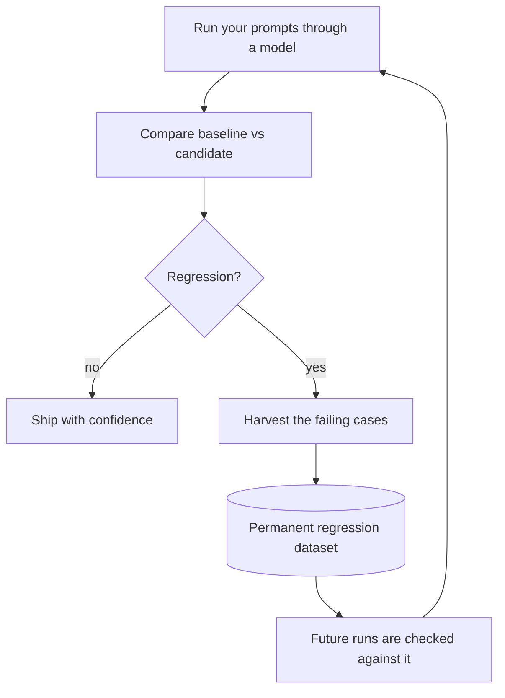

# Model Failure Lab

### Catch LLM regressions before your users do.

You change a prompt, swap a model, or bump a version — and quietly break answers that used to work.
Model Failure Lab is a command-line tool that **compares two versions of your LLM/RAG system, tells
you exactly what got worse, and turns those failures into a permanent test** so the same regression
can't slip through again.

It runs entirely on your machine — no account, no cloud, no API keys to get started — and you can see
the whole thing work in **under two minutes, fully offline**:

```bash
pip install model-failure-lab
bash examples/regression_demo/run.sh      # from a clone — see a real regression caught
```

[](https://github.com/Padraigobrien08/model-failure-lab/actions/workflows/production.yml)
[](https://pypi.org/project/model-failure-lab/)


---

## The workflow

**Run** your prompts → **Compare** two versions → if there's a **regression**, **Harvest** the broken
cases → keep them as a **permanent regression dataset** → every future run checks against them.



Everything is plain JSON written to disk, so your evaluation history lives in git next to your code —
diffable, reviewable, reproducible.

---

## See it catch a regression (offline, ~30s)

The repo ships a deterministic demo: two versions of a customer-support assistant where **v2 quietly
breaks 4 of 8 cases**. No model, key, or network needed.

> The `examples/regression_demo/` walkthrough ships in the **source tree** (clone, or an unpacked
> sdist) — run these commands from a checkout. If you only `pip install`ed, the offline single-run
> demo is always available as `failure-lab demo`.

```bash
failure-lab compare examples/regression_demo/runs/baseline examples/regression_demo/runs/candidate
```

Real output:

```text
Failure Lab Compare
Status: regressed
Failure rate delta: +50.0%
Case changes: regressions=4
Signal verdict: regression
Top drivers:
- instruction_following +25.0% (regression) evidence=citation-latency, format-json
- hallucination         +12.5% (regression) evidence=grounding-warranty
- reasoning             +12.5% (regression) evidence=factual-apollo
```

It pinpoints the regressions: a **hallucinated** warranty, a **dropped citation**, a **wrong fact**
(1969 → 1971), and a **format** break (ignored the JSON instruction). Then turn those failures into a
reusable test in one step:

```bash
bash examples/regression_demo/run.sh    # compare -> harvest the 4 failing cases into a dataset
```

Full walkthrough: [`examples/regression_demo/`](examples/regression_demo/).

---

## The workflow in plain English

Four commands, four plain ideas:

| Command | In plain English |
|---|---|
| **run** | Send a set of prompts through a model and record what came back, labelling each answer as a pass or a kind of failure (hallucination, wrong fact, missing citation, bad format…). |
| **compare** | Diff two runs (e.g. old model vs new model) and report what got **worse** and what got **better**. |
| **harvest** | Collect the cases that regressed into a small dataset file — the bugs, captured as test cases. |
| **promote** | Save that harvested dataset as a permanent, versioned test you can re-run forever. |

Beyond these four, there are **advanced** commands for teams — `index`/`query` (search across all your
runs), `clusters` (recurring failure themes), and `regressions`/governance (turn comparisons into
pass/fail CI gates). You can ignore them until you need them; the four above are the whole core loop.

---

## Install

```bash
pip install model-failure-lab
```

From a clone:

```bash
git clone https://github.com/Padraigobrien08/model-failure-lab
cd model-failure-lab
make install            # equivalent to: python3 -m pip install .
```

This installs the `failure-lab` command (also available as `model-failure-lab`, or
`python3 -m model_failure_lab`). The import name in Python is `model_failure_lab`.

### Optional extras

| Extra | From a clone | From the published package | Adds |
|---|---|---|---|
| Anthropic | `python3 -m pip install '.[anthropic]'` | `model-failure-lab[anthropic]` | `--model anthropic:<model>` |
| OpenAI | `python3 -m pip install '.[openai]'` | `model-failure-lab[openai]` | OpenAI model names |
| Legacy (research) | `python3 -m pip install '.[legacy]'` | `model-failure-lab[legacy]` | DistilBERT/CivilComments benchmark stack (reference only) |
| Legacy UI | `python3 -m pip install '.[ui]'` | `model-failure-lab[ui]` | Streamlit results explorer (reference only) |

For development, install the dev extra: `python3 -m pip install -e '.[dev]'` (adds `pytest` + `ruff`).

## Use it on your own prompts

```bash
# 1. Run a bundled dataset through the offline demo model
failure-lab run --dataset reasoning-failures-v1 --model demo

# 2. Summarize the run
failure-lab report --run <run-id>

# 3. Run another version (a real model), then compare baseline -> candidate
failure-lab run --dataset reasoning-failures-v1 --model ollama:llama3.2
failure-lab compare <baseline-run-id> <candidate-run-id>
```

Runs and reports are written under the current directory (`runs/`, `reports/`; override with
`--root`). Bring your own prompts as a JSON dataset — see
[`examples/regression_demo/dataset.json`](examples/regression_demo/dataset.json) for the format and
[`docs/artifact-model.md`](docs/artifact-model.md) for the full schema.

## Models

`--model` accepts:

| Value | Notes |
|---|---|
| `demo` | Deterministic, offline — great for trying the workflow and for tests |
| `ollama:<model>` | Local [Ollama](https://ollama.com) runtime |
| `anthropic:<model>` | Requires `[anthropic]` extra + `ANTHROPIC_API_KEY` |
| OpenAI model name | Requires `[openai]` extra + `OPENAI_API_KEY` |

Adding a backend is a small contract — see `docs/adapter-extension-guide.md`.

## How it compares

There are excellent tools in this space; they solve overlapping but different problems. This table is
meant to be factual, not a claim of superiority — pick what fits your workflow.

| Tool | Primary strength | Hosted? | Local? | Main focus |
|---|---|---|---|---|
| **LangSmith** | Polished UI for tracing, datasets, and evals | Yes (SaaS) | No | Observability + evaluation platform |
| **promptfoo** | Great DX for config-driven prompt evals & red-teaming | Optional | Yes | Prompt/LLM testing & security |
| **DeepEval** | Pytest-style assertions with many model-graded metrics | Optional | Yes | LLM unit-testing & metrics |
| **Ragas** | Research-backed RAG metrics (faithfulness, context recall…) | No | Yes | RAG evaluation metrics |
| **Model Failure Lab** | Git-native baseline-vs-candidate regression tracking; turns regressions into permanent datasets | No | Yes | Regression detection & failure-to-test workflow |

Honest limitations: Model Failure Lab is pre-1.0, ships fewer built-in metrics than DeepEval/Ragas,
has no hosted UI, and is Python/CLI-only. If you want a managed dashboard (LangSmith), a large metric
library (DeepEval), deep RAG metrics (Ragas), or red-teaming (promptfoo), reach for those. Reach for
Model Failure Lab when you want **local, git-tracked, version-to-version regression history** and a
loop that converts failures into durable tests.

## Advanced

Beyond the core loop, the CLI can build a derived SQLite index over your artifacts
(`failure-lab index rebuild`) to power cross-run `query`, recurring failure `clusters`, `history`, and
`regressions` governance gates for CI. See `docs/architecture.md`.

## Development

```bash
make install-dev      # editable install with dev extras
make check            # ruff + production test suite
make test             # production test suite (legacy ML tests auto-skip without the [legacy] extra)
make test-legacy      # legacy research tests (needs '.[legacy]' installed)
```

The production CLI is dependency-isolated from the optional research/ML stack: running
`run`/`report`/`compare` never imports `torch`, `pandas`, `numpy`, etc. (enforced by
`tests/unit/test_production_cli_isolation.py`).

## Documentation

| Doc | Topic |
|---|---|
| `examples/regression_demo/` | The offline regression walkthrough |
| `docs/architecture.md` | Modules, control flow, design patterns |
| `docs/setup.md` | Setup, environment variables, common issues |
| `docs/api.md` | CLI surface and internal interfaces |
| `docs/artifact-model.md` | Artifact schemas and examples |
| `docs/adapter-extension-guide.md` | Add a model adapter |

## Project status

Pre-1.0 (`0.9.0`, public beta). Versioning intent: patch = fixes/docs, minor = CLI-compatible additions, breaking
= CLI or artifact-schema changes. The DistilBERT/CivilComments benchmark stack under `[legacy]` is
retained for reference and is not part of the supported workflow (`docs/legacy.md`).

## License

MIT — see `LICENSE`.
