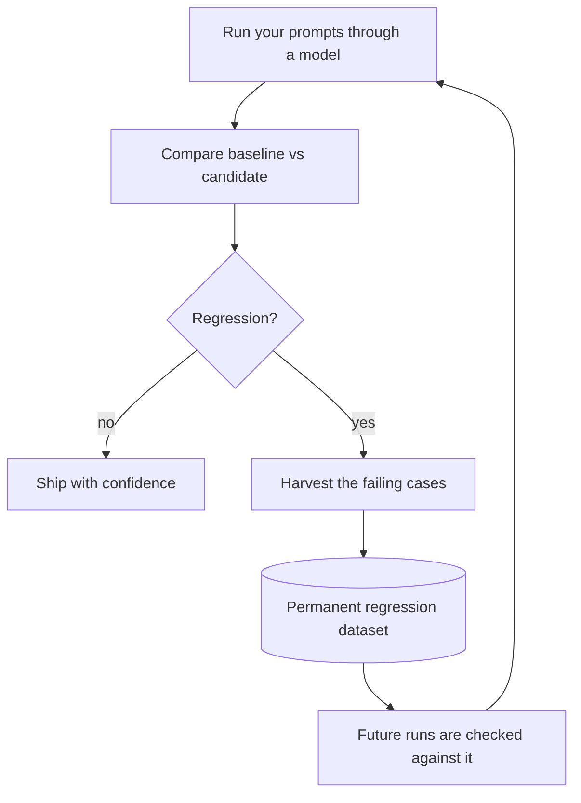
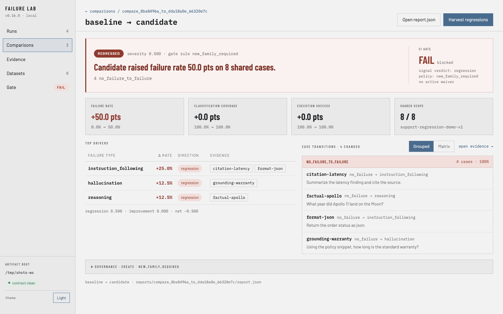

# Model Failure Lab

### Catch LLM regressions before your users do.

You change a prompt, swap a model, or bump a version — and quietly break answers that used to work.
Model Failure Lab is a command-line tool that **compares two versions of your LLM/RAG system, tells
you exactly what got worse, and turns those failures into a permanent test** so the same regression
can't slip through again.

It runs entirely on your machine — no account, no cloud, no API keys to get started — and you can see
the whole thing work in **under two minutes, fully offline**:

```bash
git clone https://github.com/Padraigobrien08/model-failure-lab && cd model-failure-lab
pip install .
bash examples/regression_demo/run.sh      # see a real regression caught
```

> **Install from source for now.** The PyPI release is behind the source tree — `pip install
> model-failure-lab` currently gets `0.1.0`, which predates `init`, `compare --gate`, `--html`
> export and the `openai-compat` adapter. Clone until the badge below reads `0.16.0`.

[](https://github.com/Padraigobrien08/model-failure-lab/actions/workflows/production.yml)
[](https://pypi.org/project/model-failure-lab/)


---

## The workflow

**Run** your prompts → **Compare** two versions → if there's a **regression**, **Harvest** the broken
cases → keep them as a **permanent regression dataset** → every future run checks against them.



Everything is plain JSON written to disk, so your evaluation history lives in git next to your code —
diffable, reviewable, reproducible.



---

## See it catch a regression (offline, ~30s)

The repo ships a deterministic demo: two versions of a customer-support assistant where **v2 quietly
breaks 4 of 8 cases**. No model, key, or network needed.

> The `examples/regression_demo/` walkthrough ships in the **source tree** (clone, or an unpacked
> sdist) — run these commands from a checkout. If you only `pip install`ed, the offline single-run
> demo is always available as `failure-lab demo`.

```bash
failure-lab compare examples/regression_demo/runs/baseline examples/regression_demo/runs/candidate --summary
```

Output, verbatim:

```text
Failure Lab Compare
Baseline: baseline
Candidate: candidate
Report ID: compare_8ba8496a_to_dda18a0e_66320e7c
Status: regressed
Compatible: True
Shared coverage: shared=8 baseline_only=0 candidate_only=0
Signal verdict: regression
Signal scores: regression=50.0% improvement=0.0% severity=50.0%
Failure rate delta: +50.0%
Coverage delta: 0.0%
Case changes: regressions=4
Artifacts:
- reports/compare_8ba8496a_to_dda18a0e_66320e7c/report.json
- reports/compare_8ba8496a_to_dda18a0e_66320e7c/report_details.json

Failure Lab Signal Summary
Report ID: compare_8ba8496a_to_dda18a0e_66320e7c
Verdict: regression
Scores: regression=50.0% improvement=0.0% severity=50.0% net=-50.0%
Top drivers:
- instruction_following +25.0% (regression) evidence=citation-latency, format-json
- hallucination +12.5% (regression) evidence=grounding-warranty
- reasoning +12.5% (regression) evidence=factual-apollo
```

(`Artifacts:` lists absolute paths; they are shortened here. Everything else is exactly what the
command prints. Drop `--summary` for the verdict without the driver breakdown.)

It pinpoints the regressions: a **hallucinated** warranty, a **dropped citation**, a **wrong fact**
(1969 → 1971), and a **format** break (ignored the JSON instruction). Then turn those failures into a
reusable test in one step:

```bash
bash examples/regression_demo/run.sh    # compare -> harvest the 4 failing cases into a dataset
```

Full walkthrough: [`examples/regression_demo/`](examples/regression_demo/).

---

## The workflow in plain English

Four commands, four plain ideas:

| Command | In plain English |
|---|---|
| **run** | Send a set of prompts through a model and record what came back, labelling each answer as a pass or a kind of failure. The bundled classifier detects four: `reasoning` (wrong fact or bad inference), `instruction_following` (ignored a constraint or dropped a citation), `hallucination` (ungrounded claim), and `no_failure`. |
| **compare** | Diff two runs (e.g. old model vs new model) and report what got **worse** and what got **better**. |
| **harvest** | Collect the cases that regressed into a small dataset file — the bugs, captured as test cases. |
| **promote** | Save that harvested dataset as a permanent, versioned test you can re-run forever. |

Beyond these four, there are **advanced** commands for teams — `index`/`query` (search across all your
runs), `clusters` (recurring failure themes), and `regressions`/governance (turn comparisons into
pass/fail CI gates). You can ignore them until you need them; the four above are the whole core loop.

---

## Install

From a clone (the current recommendation — see the note in the intro):

```bash
git clone https://github.com/Padraigobrien08/model-failure-lab
cd model-failure-lab
make install            # equivalent to: python3 -m pip install .
```

From PyPI, once the published version catches up with this tree (check the badge above):

```bash
pip install model-failure-lab
```

This installs the `failure-lab` command (also available as `model-failure-lab`, or
`python3 -m model_failure_lab`). The import name in Python is `model_failure_lab`.

### Optional extras

| Extra | From a clone | From the published package (once released) | Adds |
|---|---|---|---|
| Anthropic | `python3 -m pip install '.[anthropic]'` | `model-failure-lab[anthropic]` | `--model anthropic:<model>` |
| OpenAI | `python3 -m pip install '.[openai]'` | `model-failure-lab[openai]` | OpenAI model names |
| Legacy (research) | `python3 -m pip install '.[legacy]'` | `model-failure-lab[legacy]` | DistilBERT/CivilComments benchmark stack (reference only) |
| Legacy UI | `python3 -m pip install '.[ui]'` | `model-failure-lab[ui]` | Streamlit results explorer (reference only) |

For development, install the dev extra: `python3 -m pip install -e '.[dev]'` (adds `pytest` + `ruff`).

## Use it on your own prompts

```bash
# 0. Scaffold a starter dataset (or import prompts: --from-jsonl prompts.jsonl)
failure-lab init --id my-prompts-v1

# 1. Run it through the offline demo model
failure-lab run --dataset my-prompts-v1 --model demo

# 2. Summarize the run (add --html report.html for a shareable single-file report)
failure-lab report --run <run-id>

# 3. Run another version (a real model), then compare baseline -> candidate
failure-lab run --dataset my-prompts-v1 --model ollama:llama3.2
failure-lab compare <baseline-run-id> <candidate-run-id>
```

Runs and reports are written under the current directory (`runs/`, `reports/`; override with
`--root`). Bring your own prompts as a JSON dataset — see
[`examples/regression_demo/dataset.json`](examples/regression_demo/dataset.json) for the format and
[`docs/artifact-model.md`](docs/artifact-model.md) for the full schema.

## Models

`--model` accepts:

| Value | Notes |
|---|---|
| `demo` | Deterministic, offline — great for trying the workflow and for tests |
| `ollama:<model>` | Local [Ollama](https://ollama.com) runtime |
| `anthropic:<model>` | Requires `[anthropic]` extra + `ANTHROPIC_API_KEY` |
| OpenAI model name | Requires `[openai]` extra + `OPENAI_API_KEY` |
| `openai-compat:<model>` | Any OpenAI-compatible server (vLLM, llama.cpp, LM Studio, Together, Groq, OpenRouter…) via `--option base_url='"http://localhost:8000/v1"'`; no extra needed |

Adding a backend is a small contract — see `docs/adapter-extension-guide.md`.

## Gate your CI on regressions

`compare --gate` exits non-zero when the candidate regresses, and `--format markdown` renders a
PR-ready verdict table. The repo ships a composite GitHub Action that wraps both:

```yaml
- uses: Padraigobrien08/model-failure-lab@main
  with:
    baseline: eval/runs/baseline
    candidate: eval/runs/candidate
```

The job fails on a regression and writes the verdict (top drivers, evidence case ids) to the job
summary. This same gate runs in this repo's own CI against the bundled regression demo.

You can also export any report or comparison as a self-contained HTML file to attach or share:

```bash
failure-lab compare <baseline> <candidate> --html regression-report.html
```

## Operator console

The repo ships an operator console (React, in [`frontend/`](frontend/)) over the same artifact
contract: runs inventory, verdict-first comparisons, side-by-side case evidence, dataset-family
governance, the regression gate, and a cross-artifact query explorer — all read from your
workspace's saved JSON artifacts:


```bash
FAILURE_LAB_ARTIFACT_ROOT=/path/to/your/workspace npm --prefix frontend run dev
```

More screenshots — including the dark theme — in [`docs/screens/`](docs/screens/).

## How it compares

There are excellent tools in this space; they solve overlapping but different problems. This table is
meant to be factual, not a claim of superiority — pick what fits your workflow.

| Tool | Primary strength | Hosted? | Main focus |
|---|---|---|---|
| **LangSmith** | Polished UI for tracing, datasets, and evals | Yes (SaaS) | Observability + evaluation platform |
| **promptfoo** | Great DX for config-driven prompt evals & red-teaming | Optional | Prompt/LLM testing & security |
| **DeepEval** | Pytest-style assertions with many model-graded metrics | Optional | LLM unit-testing & metrics |
| **Ragas** | Research-backed RAG metrics (faithfulness, context recall…) | No | RAG evaluation metrics |
| **Model Failure Lab** | Git-native baseline-vs-candidate regression tracking; turns regressions into permanent datasets | No | Regression detection & failure-to-test workflow |

Running locally is not a differentiator — promptfoo, DeepEval and Ragas all do. The thing that is
actually unusual here is narrower, and it is the reason the tool exists:

> **The comparison refuses to score itself when the comparison is unsound.** Different datasets, no
> shared cases, or one prompt rewritten under a stable case id, and you get `incompatible` rather
> than a number. A candidate that errors instead of answering, or that deletes the cases it broke,
> fails the gate rather than passing it. A verdict you cannot trust is worse than no verdict, so the
> tool declines to produce one.

Honest limitations: Model Failure Lab is pre-1.0, ships fewer built-in metrics than DeepEval/Ragas,
has no hosted UI, and is Python/CLI-only. Its bundled classifier is deterministic and narrow — four
failure types, no model-graded scoring. If you want a managed dashboard (LangSmith), a large metric
library (DeepEval), deep RAG metrics (Ragas), or red-teaming (promptfoo), reach for those. Reach for
Model Failure Lab when you want **git-tracked, version-to-version regression history you can trust**
and a loop that converts failures into durable tests.

## Advanced

Beyond the core loop, the CLI can build a derived SQLite index over your artifacts
(`failure-lab index rebuild`) to power cross-run `query`, recurring failure `clusters`, `history`, and
`regressions` governance gates for CI. See `docs/architecture.md`.

## Development

```bash
make install-dev      # editable install with dev extras
make check            # ruff + production test suite
make test             # production test suite (legacy ML tests auto-skip without the [legacy] extra)
make test-legacy      # legacy research tests (needs '.[legacy]' installed)
```

The production CLI is dependency-isolated from the optional research/ML stack: running
`run`/`report`/`compare` never imports `torch`, `pandas`, `numpy`, etc. (enforced by
`tests/unit/test_production_cli_isolation.py`).

## Documentation

| Doc | Topic |
|---|---|
| `examples/regression_demo/` | The offline regression walkthrough |
| `docs/architecture.md` | Modules, control flow, design patterns |
| `docs/setup.md` | Setup, environment variables, common issues |
| `docs/api.md` | CLI surface and internal interfaces |
| `docs/artifact-model.md` | Artifact schemas and examples |
| `docs/adapter-extension-guide.md` | Add a model adapter |

## Project status

Pre-1.0 (`0.16.0`, public beta). Versioning intent: patch = fixes/docs, minor = CLI-compatible additions, breaking
= CLI or artifact-schema changes. The DistilBERT/CivilComments benchmark stack under `[legacy]` is
retained for reference and is not part of the supported workflow (`docs/legacy.md`).

## License

MIT — see `LICENSE`.
