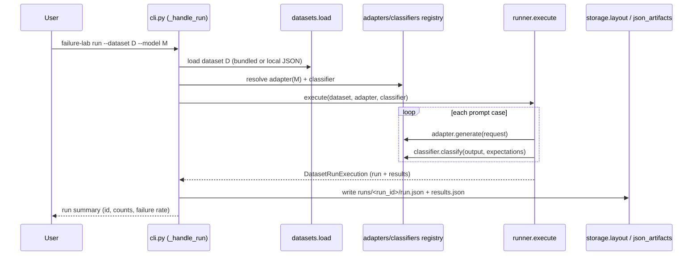

# Architecture

> Baseline audit, generated 2026-06-29. Supersedes the previous short architecture note. Describes
> the repository **as-is**. This document focuses on cross-file structure that requires reading
> multiple files to understand.

## Core product loop

```
run -> report -> compare -> harvest -> promote -> rerun
```

1. `failure-lab run` executes a dataset with a model adapter + classifier, then writes run artifacts.
2. `failure-lab report` summarizes one run into report artifacts.
3. `failure-lab compare` computes baseline vs candidate deltas and signal drivers.
4. `failure-lab harvest` selects failure/regression cases into a draft pack.
5. `failure-lab dataset promote` creates an immutable curated dataset version.
6. A rerun against promoted datasets closes the reliability loop.

## Directory structure

```text
model-failure-lab/
├── src/model_failure_lab/      # Python package (142 .py files, ~35.5k LOC)
│   ├── cli.py                  # Single argparse surface (4,157 LOC, 44 handlers) — PRODUCTION
│   ├── __main__.py             # `python -m model_failure_lab` entry
│   ├── adapters/               # Model adapters (demo/ollama/anthropic/openai) — PRODUCTION
│   ├── classifiers/            # Failure classifiers + registry — PRODUCTION
│   ├── runner/                 # Run execution + artifact writing — PRODUCTION
│   ├── storage/                # CWD-relative artifact layout (layout.py) — PRODUCTION
│   ├── schemas/                # Core dataclasses (Run/Result/Report/PromptCase) — PRODUCTION
│   ├── datasets/               # Dataset load/bundled/local/evolution — PRODUCTION
│   ├── reporting/              # MIXED: core/compare (prod) + bundle/mitigation/... (legacy)
│   ├── index/                  # Derived SQLite query index — PRODUCTION
│   ├── analysis/               # Grounded insight reports over the index — PRODUCTION
│   ├── governance/             # Policy/gates/lifecycle/portfolio — PRODUCTION
│   ├── harvest/                # Harvest + promotion seams — PRODUCTION
│   ├── clusters.py             # Recurring failure clusters — PRODUCTION
│   ├── history.py              # Run/comparison/dataset history — PRODUCTION
│   ├── testing/                # Insight fixture workspace builders — PRODUCTION (test support)
│   ├── artifact_index/         # Manifest-style artifact index (build/load/validate) — LEGACY-leaning
│   ├── tracking/               # Run-id/metrics/manifest tracking — LEGACY
│   ├── runners/                # dispatch.py (943 LOC) — LEGACY benchmark dispatch
│   ├── models/                 # distilbert / logistic_tfidf — LEGACY (torch/sklearn)
│   ├── mitigations/            # group_dro/reweighting/temperature_scaling/... — LEGACY (torch)
│   ├── perturbations/          # perturbation suites/scoring — LEGACY
│   ├── evaluation/             # aggregate/subgroup/calibration/robustness — LEGACY (pandas/sklearn)
│   ├── data/                   # civilcomments/materialization/canonical schema — LEGACY
│   ├── results_ui/             # Streamlit UI — LEGACY
│   ├── config/                 # YAML RunConfig loader/schema — LEGACY (experiment configs)
│   └── utils/                  # paths.py (legacy roots), runtime.py
├── scripts/                    # Operational scripts (mostly legacy ML pipelines)
├── configs/                    # YAML experiment configs (all CivilComments/DistilBERT) — LEGACY
├── frontend/                   # React 19 + Vite debugger UI
├── tests/unit/                 # 60 test files
├── docs/                       # This documentation set
├── artifacts/                  # Legacy artifact root (gitignored except .gitkeep)
├── Makefile, pyproject.toml    # Build/dev entry points
└── .github/workflows/ci.yml    # CI
```

> "PRODUCTION" vs "LEGACY" tags above are an audit classification derived from imports, the `[legacy]`
> extra, and `docs/legacy.md`. They are not formal markers in the code.

## Major modules and responsibilities

### Production path

| Module | Responsibility | Key files |
|---|---|---|
| `cli.py` | Argparse command surface; one `_handle_*` per command; orchestration | `cli.py` |
| `adapters/` | `ModelAdapter` protocol + registry; demo/ollama/anthropic/openai backends | `contracts.py`, `registry.py`, `*_adapter.py` |
| `classifiers/` | Classifier protocol + registry + built-in heuristics | `contracts.py`, `registry.py` |
| `runner/` | Execute a dataset case-by-case; build run/results artifacts | `execute.py`, `artifacts.py`, `contracts.py`, `identity.py` |
| `storage/` | Deterministic CWD-relative artifact paths and JSON IO | `layout.py`, `json_artifacts.py` |
| `schemas/` | Canonical dataclasses + payload validation + failure taxonomy | `contracts.py`, `taxonomy.py` |
| `datasets/` | Load bundled/local datasets; dataset evolution & versioning | `bundled.py`, `local.py`, `load.py`, `evolution.py` |
| `reporting/` (prod part) | Build run reports & comparison deltas/signals | `core.py`, `compare.py`, `signals.py`, `markdown.py`, `selection.py`, `load.py`, `discovery.py` |
| `index/` | Build/query the derived SQLite index; contract validation | `builder.py` (1,116 LOC), `query.py`, `contracts.py` |
| `analysis/` | Grounded insight reports + comparison explainers + prompt builder | `summarizer.py`, `comparison_explainer.py`, `prompt_builder.py`, `contracts.py` |
| `governance/` | Recommendations, gates, lifecycle, portfolio planning/execution/outcomes | `policy.py`, `gates.py`, `workflow.py`, `portfolio.py` (1,340 LOC), `execution.py` (1,029 LOC), `outcomes.py`, `baselines.py`, `intelligence.py`, `lifecycle.py` |
| `harvest/` | Harvest failing/regressing cases; review duplicates; promote | `pipeline.py`, `review.py` |
| `clusters.py` / `history.py` | Recurring cluster summaries; deterministic history snapshots | — |

### Legacy path (reference only)

| Module | Responsibility |
|---|---|
| `models/` | DistilBERT + logistic-TF-IDF baseline training (torch/sklearn) |
| `mitigations/` | Group DRO, reweighting, temperature scaling, group-balanced sampling |
| `perturbations/` | Perturbation suite generation, scoring, metrics |
| `evaluation/` | Aggregate/subgroup/calibration/robustness metrics (pandas/sklearn) |
| `data/` | CivilComments loading + canonical dataset materialization |
| `runners/dispatch.py` | Config-driven benchmark run dispatch |
| `tracking/` | Run-id, metrics, manifest tracking for benchmark runs |
| `config/` | YAML `RunConfig` schema + loader for `configs/experiments/*.yaml` |
| `results_ui/` | Streamlit dashboard over benchmark artifacts |
| `artifact_index/` | Manifest-style JSON artifact index (distinct from `index/` SQLite) |

> **Naming hazard:** there are two run-execution packages (`runner/` = production, `runners/` =
> legacy) and two index systems (`index/` SQLite = production query index; `artifact_index/` JSON
> manifest = legacy/UI manifest). Do not conflate them.

## How components communicate

- **In-process function calls only.** There is no network service, message bus, or RPC layer. The CLI
  imports library functions directly.
- **Filesystem as the integration contract.** Commands hand off through JSON artifacts on disk
  (`runs/`, `reports/`, `datasets/`, `governance/`) and a derived SQLite index (`.failure_lab/`).
- **Cross-process handoff to the React UI** is one-directional and read-only via the
  `FAILURE_LAB_ARTIFACT_ROOT` environment variable; the UI parses static artifacts.
- **Registries** decouple the runner from concrete backends: `adapters/registry.py` resolves a
  `--model` string to a `ModelAdapter`; `classifiers/registry.py` resolves a classifier.

## Control flow (production `run`)



`report`, `compare`, `harvest`, and `index rebuild` follow the same shape: load artifacts from disk,
compute deterministic dataclasses, write artifacts back, print a summary.

## Important design patterns

| Pattern | Where | Notes |
|---|---|---|
| Registry / pluggable backends | `adapters/registry.py`, `classifiers/registry.py` | `--model`/classifier strings resolved to implementations; raises `UnknownModelAdapterError` / `UnknownClassifierError` |
| Protocol-based interfaces | `adapters/contracts.py` (`ModelAdapter(Protocol)`), `classifiers/contracts.py` | Structural typing for adapters/classifiers |
| Immutable value objects | 45 modules use `@dataclass` | Run/Result/Report and most summaries are dataclasses |
| Deterministic serialization | `storage/json_artifacts.py`, segment normalizers in `storage/layout.py` & `utils/paths.py` | Sorted keys + slugified IDs ⇒ reproducible artifacts |
| Derived read model (CQRS-ish) | `index/builder.py` → SQLite; `query.py` reads | Index is a rebuildable projection over canonical JSON |
| Handler dispatch | `cli.py` `set_defaults(handler=...)` | Each subparser binds a `_handle_*` function |

## External integrations

| Integration | Mechanism | Required when |
|---|---|---|
| Anthropic API | `adapters/anthropic_adapter.py` (imports `anthropic`) | `--model anthropic:*`; needs `[anthropic]` extra + API key |
| OpenAI API | `adapters/openai_adapter.py` (imports `openai`) | OpenAI model names; needs `[openai]` extra + API key |
| Ollama (local) | `adapters/ollama_adapter.py` | `--model ollama:*`; needs local Ollama runtime |
| React UI | static artifacts via `FAILURE_LAB_ARTIFACT_ROOT`; `scripts/run_react_ui.py` shells out to `npm` | UI usage |
| WILDS / CivilComments | `data/civilcomments.py`, `wilds` package | Legacy benchmark only |

> API keys: read from environment by the respective SDKs. The repo does not vendor a secrets loader;
> `.env*` is gitignored.

## Configuration management

There are **two** configuration mechanisms:

1. **Production:** primarily CLI flags. Artifact root is the current working directory unless
   `--root` is passed (`storage/layout.py:project_root`). Governance policy defaults live in code and
   can be overridden by CLI flags / policy files (`docs/architecture` legacy note, `governance/policy.py`).
2. **Legacy:** YAML files under `configs/` (`data/`, `model/`, `train/`, `eval/`, `experiments/`)
   loaded by `config/loader.py` into `config/schema.py:RunConfig`. All shipped configs target
   CivilComments + DistilBERT/logistic baselines (`configs/README.md`).

Environment variables (see `docs/setup.md` for the full table):

| Variable | Consumer | Effect |
|---|---|---|
| `MODEL_FAILURE_LAB_ARTIFACT_ROOT` | `utils/paths.py` (legacy + tests) | Overrides legacy `artifacts/` root |
| `MODEL_FAILURE_LAB_CONFIG_ROOT` | `utils/paths.py` | Overrides `configs/` root |
| `FAILURE_LAB_ARTIFACT_ROOT` | React UI / `scripts/run_react_ui.py` | Workspace the UI reads |

## Artifact model

Production artifacts (under the active root / `--root`):

| Artifact | Path | Writer |
|---|---|---|
| Dataset | `datasets/<id>.json` | `storage/layout.dataset_file` |
| Run | `runs/<run_id>/run.json`, `results.json` | `runner/artifacts.py` |
| Report | `reports/<report_id>/report.json`, `report_details.json` | `reporting/` |
| Governance | `governance/lifecycle_actions/`, `governance/portfolio_plans/`, … | `storage/layout.py` |
| Query index | `.failure_lab/query_index.sqlite3` | `index/builder.py` |

Legacy artifacts live under `artifacts/` (`baselines/`, `mitigations/`, parquet predictions, report
packages) via `utils/paths.py`. See `docs/artifact-model.md` for payload examples.
