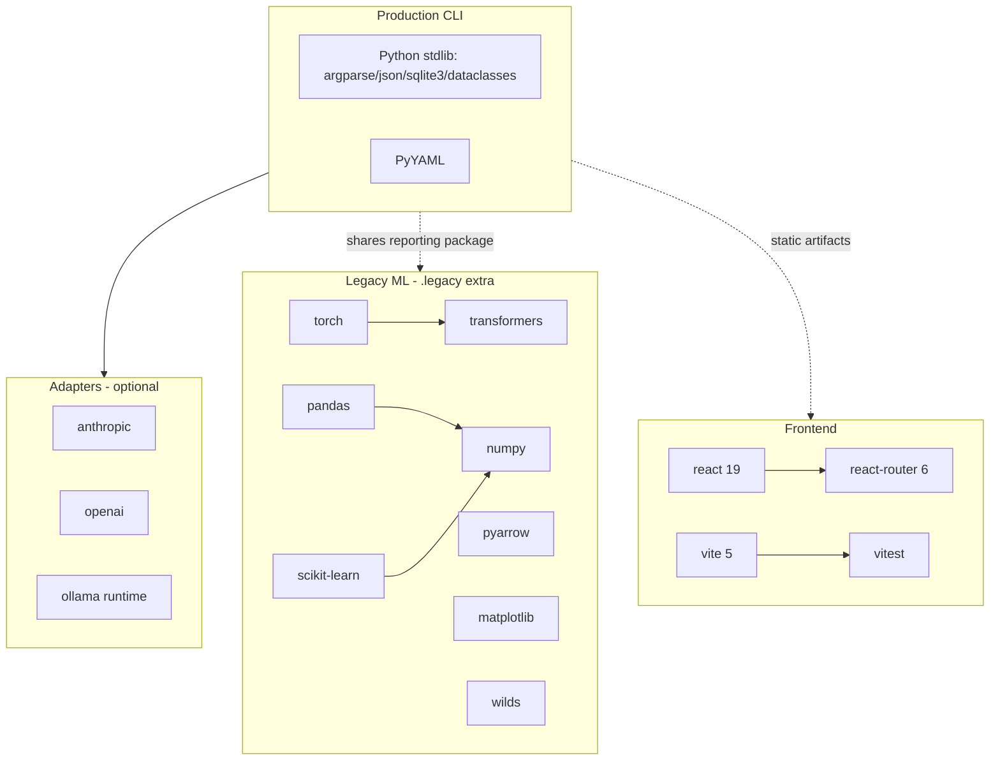

# Dependency Analysis

> Baseline audit, generated 2026-06-29. Declared dependencies from `pyproject.toml` and
> `frontend/package.json`. Installed versions observed via `pip list` in the audit environment.

## Python — declared (`pyproject.toml`)

### Runtime (hard)

| Package | Why it exists |
|---|---|
| `PyYAML` | Loads legacy YAML experiment configs (`config/loader.py`, `configs/*.yaml`). The **only** mandatory runtime dependency. |

> The production CLI's core loop (run/report/compare/harvest/index over JSON) relies on the standard
> library (`argparse`, `json`, `sqlite3`, `pathlib`, `dataclasses`). PyYAML is only strictly needed by
> the legacy config path, yet it is the sole hard dependency — see "Observations".

### Optional extras

| Extra | Packages | Why it exists |
|---|---|---|
| `anthropic` | `anthropic` | `AnthropicAdapter` for `--model anthropic:*` |
| `openai` | `openai>=1.0.0` | `OpenAIAdapter` for OpenAI model names |
| `dev` | `pytest`, `ruff` | Test + lint |
| `legacy` | `matplotlib`, `pandas`, `pyarrow`, `scikit-learn`, `torch`, `transformers`, `wilds` | DistilBERT/logistic benchmark stack: models, mitigations, perturbations, evaluation, data materialization, figures |
| `openai` / `anthropic` | (above) | Live model calls |
| `ui` | `streamlit` | Legacy Streamlit results UI (`results_ui/`) |

### Build / publish (via `Makefile`, not in `pyproject` deps)

| Tool | Use |
|---|---|
| `setuptools>=68`, `wheel` | Build backend (`[build-system]`) |
| `build` | `make build` |
| `twine` | `make verify-dist`, `make publish` |

## Python — installed versions (audit environment)

| Package | Installed | Notes |
|---|---|---|
| `numpy` | **2.2.6** | ⚠️ ABI-incompatible with the installed pandas (see Technical Debt) |
| `pandas` | **2.1.1** | Built against numpy 1.x ⇒ `numpy.dtype size changed` at import |
| `pyarrow` | 23.0.1 | |
| `scikit-learn` | 1.9.0 | |
| `torch` | 2.8.0 | |
| `torchvision` | 0.23.0 | Not a declared dependency — present transitively/manually |
| `transformers` | 4.55.0 | |
| `sentence-transformers` | 5.6.0 | Not declared in `pyproject.toml` — extra/transitive |
| `matplotlib` | 3.10.5 | |
| `wilds` | 2.0.0 | |
| `pytest` | 8.4.2 | |
| `ruff` | 0.13.3 | |

> The numpy/pandas pair is the single most consequential dependency problem in the audited
> environment: it blocks the full test suite. See `docs/technical-debt.md`.

## Frontend — declared (`frontend/package.json`)

### Runtime

| Package | Why |
|---|---|
| `react` ^19.1.0, `react-dom` ^19.1.0 | UI framework |
| `react-router-dom` ^6.30.0 | Client-side routing (route files in `frontend/src/app/routes/`) |
| `class-variance-authority` ^0.7.1, `clsx` ^2.1.1, `tailwind-merge` ^3.3.0 | Tailwind class composition utilities |
| `lucide-react` ^0.511.0 | Icons |

### Dev

| Package | Why |
|---|---|
| `vite` ^5.4.19, `@vitejs/plugin-react` ^4.4.1 | Build/dev server |
| `typescript` ^5.8.3, `@types/*` | Typing |
| `vitest` ^3.1.3, `@testing-library/*`, `jsdom` | Tests (28 test files under `frontend/src/**/__tests__`) |
| `tailwindcss` ^3.4.17, `postcss` ^8.5.3, `autoprefixer` ^10.4.21 | Styling pipeline |

## Dependency graph (high level)

## Potentially obsolete / questionable packages

| Item | Concern |
|---|---|
| `pandas` 2.1.1 + `numpy` 2.2.6 | ABI mismatch; either should be re-pinned. The pair as installed is non-functional for imports. |
| `torchvision` 0.23.0 | Installed but **not declared** in `pyproject.toml`; no obvious image use found in `src/` (grep shows no torchvision imports in the package — assumption: leftover/transitive). |
| `sentence-transformers` 5.6.0 | Installed but **not declared**; usage not confirmed in `src/`. |
| Entire `legacy` extra | By the project's own docs (`docs/legacy.md`) this stack is reference-only; it is the heaviest dependency surface and gates CI. Candidate for extraction into a separate optional package or removal during modernization. |
| `PyYAML` as the sole hard runtime dep | Only consumed by the legacy config path; the production CLI could plausibly run without it. Worth confirming before relying on it. |

## Observations

- The production runtime footprint is intentionally tiny (stdlib + PyYAML). This is a strength for the
  supported path.
- Almost all dependency weight (and all known fragility) is in the `legacy` extra, which also blocks
  the full test run and the importable `reporting` package.
- Two npm projects exist conceptually but only `frontend/package.json` is real; the repo root has no
  `package.json`.
