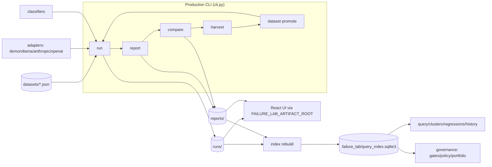

# Repository Overview

> Baseline audit, generated 2026-06-29. Describes the repository **as-is**. Statements are based on
> repository contents; assumptions are called out explicitly in the "Assumptions" section.

## Purpose

Model Failure Lab is a **local-first evaluation and failure-analysis toolkit for LLM and RAG
systems** (`pyproject.toml`, `README.md`). It executes prompt datasets against model adapters,
classifies failures, compares model versions, and turns regressions into reusable test cases. The
supported product loop is:

```
run -> report -> compare -> harvest -> promote -> rerun
```

The stated primary value is preserving **deterministic artifact history** so teams can convert
regressions into durable datasets and governance decisions (`README.md`, `docs/architecture.md`).

## Two surfaces in one repository (critical context)

The repository contains **two largely separate systems**. Distinguishing them is essential to
reading the codebase correctly.

| Surface | Status | Entry point | Artifact root | Key dependencies |
|---|---|---|---|---|
| **Production LLM/RAG workflow** | Supported | `src/model_failure_lab/cli.py` | CWD-relative (`runs/`, `reports/`, `datasets/`, `governance/`), honors `--root` | `PyYAML` only (+ optional model SDKs) |
| **Legacy ML benchmark stack** | Reference only (`docs/legacy.md`) | `scripts/run_baseline.py`, `scripts/run_mitigation.py`, etc. + `configs/` | `MODEL_FAILURE_LAB_ARTIFACT_ROOT` (default `artifacts/`) | `torch`, `transformers`, `pandas`, `numpy`, `scikit-learn`, `pyarrow`, `wilds` (`[legacy]` extra) |

The legacy stack targets a WILDS/CivilComments DistilBERT robustness benchmark (see `configs/` and
`src/model_failure_lab/models/`, `mitigations/`, `perturbations/`, `evaluation/`). It is retained for
historical reference and is **not** part of the production path.

## Current capabilities (verified)

Production CLI (`failure-lab` / `model-failure-lab` / `python3 -m model_failure_lab`):

| Capability | Command(s) | Notes |
|---|---|---|
| Execute a prompt dataset through a model + classifier | `run`, `demo` | Verified: `demo` produces run/report artifacts |
| Summarize a run | `report` | |
| Diff baseline vs candidate runs | `compare` | |
| List bundled datasets | `datasets list` | Verified: returns reasoning/rag/hallucination packs |
| Harvest failing/regressing cases into a draft pack | `harvest` | |
| Promote/evolve curated dataset versions | `dataset promote\|versions\|evolve\|...` (16 subcommands) | |
| Build/validate derived SQLite query index | `index rebuild\|validate` | Index stored at `.failure_lab/query_index.sqlite3` |
| Cross-run queries | `query` | |
| Run/comparison/dataset history | `history` | |
| Recurring failure clusters | `clusters`, `cluster show\|history` | |
| Governance / regression gates | `regressions recommend\|review\|apply\|gate\|patterns\|generate` | |
| Portfolio planning & execution | `dataset portfolio\|plan-create\|plan-execute\|...` | |

Model adapters available (`src/model_failure_lab/adapters/`): `demo` (deterministic),
`ollama:<model>`, `anthropic:<model>`, and OpenAI model names. The latter two require optional extras.

A **React debugger UI** (`frontend/`, React 19 + Vite) reads an artifact workspace pointed to by
`FAILURE_LAB_ARTIFACT_ROOT`. A **legacy Streamlit results UI** lives at
`src/model_failure_lab/results_ui/` (`[ui]` extra).

## Major limitations (verified)

| Limitation | Evidence |
|---|---|
| The full test suite does not pass in the audited environment | `pytest -q`: **252 passed, 1 failed, 23 collection errors** — every failure/error traces to a `numpy.dtype size changed` ABI mismatch (numpy 2.2.6 vs pandas 2.1.1). See `docs/technical-debt.md`. |
| Legacy code is interleaved with production code in shared packages | `reporting/` mixes production (`core.py`, `compare.py`) with pandas/matplotlib legacy modules (`bundle.py`, `mitigation.py`, …); importing the package pulls in the legacy chain. |
| Two parallel path/root systems with confusingly similar env var names | `utils/paths.py` (`MODEL_FAILURE_LAB_ARTIFACT_ROOT`) vs `storage/layout.py` (CWD/`--root`) vs frontend (`FAILURE_LAB_ARTIFACT_ROOT`). |
| `cli.py` is a single 4,157-line argparse module | `src/model_failure_lab/cli.py` |
| No network/API server | Everything is local CLI + static-artifact React UI; no HTTP service exists. |
| No persisted secrets management beyond `.gitignore` of `.env` | `.gitignore` |

## Overall architecture (high level)



See `docs/architecture.md` for module-level detail and control flow.

## Technology stack (verified)

| Layer | Technology | Source |
|---|---|---|
| Language | Python 3.11+ | `pyproject.toml` (`requires-python = ">=3.11"`); local runtime Python 3.11.0 |
| Packaging | setuptools ≥68 + wheel, `src/` layout | `pyproject.toml` |
| CLI | stdlib `argparse` | `cli.py` |
| Config | `PyYAML` (only hard dependency) | `pyproject.toml` |
| Derived index | SQLite (stdlib `sqlite3`) | `index/builder.py`, `.failure_lab/query_index.sqlite3` |
| Data modeling | `@dataclass` (45 modules use it) | grep across `src/` |
| Lint | Ruff 0.13.x (line-length 100; rules E/F/I) | `pyproject.toml` |
| Test | pytest 8.x | `pyproject.toml`, local `pytest 8.4.2` |
| Optional model SDKs | `anthropic`, `openai` | `[anthropic]`, `[openai]` extras |
| Legacy ML | `torch`, `transformers`, `scikit-learn`, `pandas`, `pyarrow`, `matplotlib`, `wilds` | `[legacy]` extra |
| Legacy UI | `streamlit` | `[ui]` extra |
| Frontend | React 19, Vite 5, React Router 6, Tailwind 3, TypeScript 5.8, Vitest 3 | `frontend/package.json` |

## High-level data flow

1. A dataset (`datasets/*.json`, or a bundled pack from `src/model_failure_lab/datasets/`) is loaded.
2. `run` dispatches each prompt case through a **model adapter**, then a **classifier** labels the
   output against the case's expectations (`runner/execute.py`, `adapters/`, `classifiers/`).
3. Run artifacts (`run.json`, `results.json`) are written under `runs/<run_id>/`
   (`storage/layout.py`).
4. `report` builds `report.json` / `report_details.json` under `reports/<report_id>/`.
5. `compare` diffs two runs and persists a comparison report.
6. `index rebuild` projects all local artifacts into a SQLite index (`.failure_lab/`), which powers
   `query`, `clusters`, `regressions`, `history`, and governance commands.
7. `harvest` selects failing/regressing cases into a draft pack; `dataset promote` freezes an
   immutable curated dataset version, closing the loop.
8. The React UI consumes the same on-disk artifacts read-only.

## Build and runtime dependencies (summary)

- **Runtime (production):** Python 3.11+, `PyYAML`. Model adapters need their SDK only when used
  (`anthropic`, `openai`); `ollama:*` shells out to a local Ollama install.
- **Build:** `setuptools>=68`, `wheel` (`make build` adds `build`, `verify-dist`/`publish` add
  `twine`).
- **Dev:** `pytest`, `ruff` (`[dev]`).
- **Legacy/optional:** see the table above and `docs/dependencies.md`.

## Assumptions (not verified against a running system)

- The `numpy`/`pandas` ABI breakage is environmental (the audited machine has numpy 2.2.6 with pandas
  2.1.1). CI installs `.[dev,legacy]` fresh (`.github/workflows/ci.yml`), which **may** resolve a
  compatible numpy at install time; this was not reproduced here. Treated as a risk, not a confirmed
  CI failure.
- Anthropic/OpenAI/Ollama adapters were **not** exercised end-to-end (no credentials / no Ollama in
  the audit environment); their availability is inferred from code and README.
- The React UI was **not** launched (no `npm run dev` executed); its behavior is inferred from
  `frontend/` source and `scripts/run_react_ui.py`.
